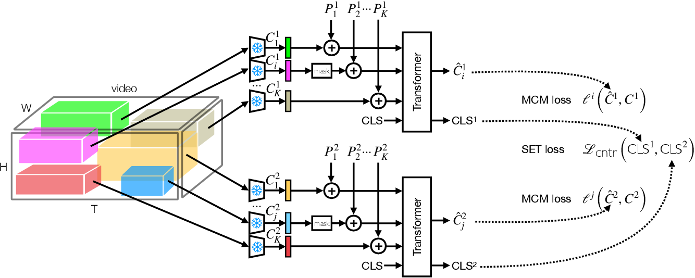

# SCALE: Spatio-Temporal Crop Aggregation for Video Representation Learning

### [Paper](https://arxiv.org/abs/2211.17042)
<br>



This repo contains code for extracting teacher representations, training the proposed method, and probing the resulting representation from our SCALE paper (ICCV 2023).

> [**Spatio-Temporal Crop Aggregation for Video Representation Learning**](https://arxiv.org/abs/2211.17042)<br>
> Sepehr Sameni, Simon Jenni, Paolo Favaro<br>
> University of Bern, Adobe Research, University of Bern<br>
> ICCV 2023

## Getting Started
In order to load the videos fast we use [video_reader](https://github.com/pytorch/vision#unstable-video-backend) which requires manual build of TorchVision. We used cuda=11.6, and python=3.8, please follow [this guide](installation.md) to install the required packages.

## Usage
Below are some example commands to run each model.

### Extracting Pretrained Features
```bash
python extract_features.py --model train --dataset ucf # for all the pretrained teachers
```

### Training SCALE
```bash
python train.py --exp_name BYOL-UCF --epochs 1000 --initialization_model byl --dataset ucf
```

### Probing SCALE
```bash
python eval.py --exp_name BYOL-UCF --dataset ucf --load -1 --freeze 
```

# Reference
If you find our code useful for your research, please cite our paper.
```
@article{Sameni2022SpatioTemporalCA,
  title={Spatio-Temporal Crop Aggregation for Video Representation Learning},
  author={Sepehr Sameni and S. Jenni and Paolo Favaro},
  journal={ArXiv},
  year={2022},
  volume={abs/2211.17042},
  url={https://api.semanticscholar.org/CorpusID:254096149}
}
```